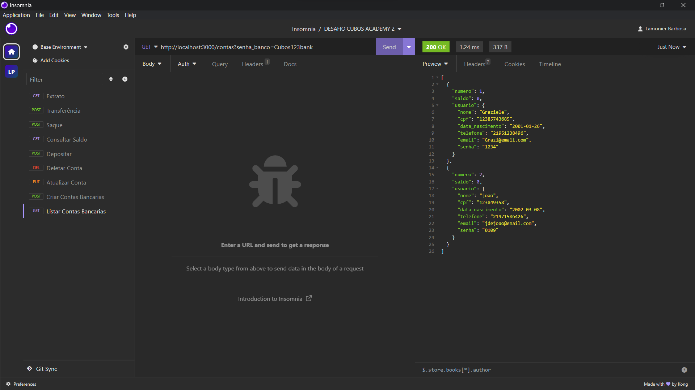
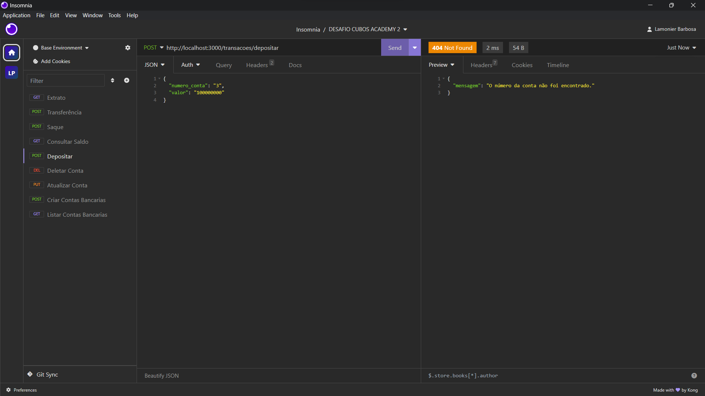
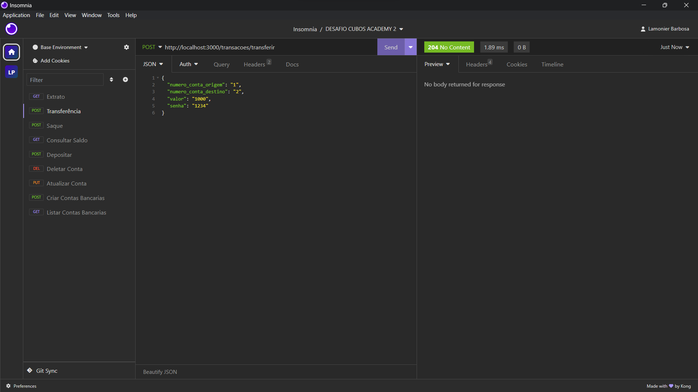
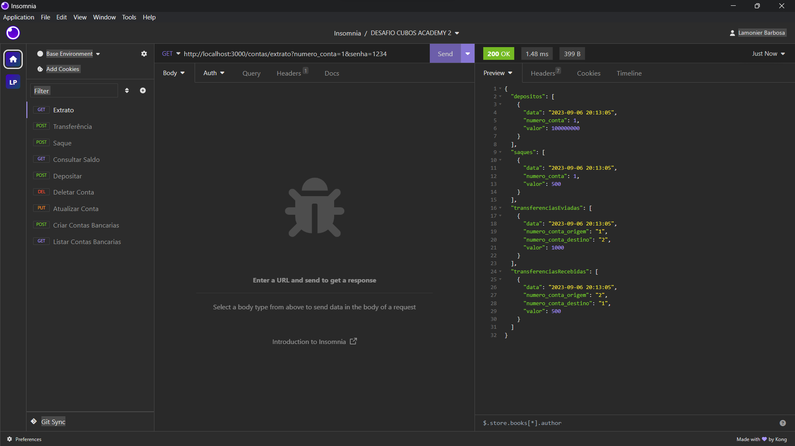

<p align="center">

<p/>

Este é um projeto de sistema bancário que permite executar e testar suas funcionalidades através do Insomnia. Para executar o projeto, basta dar um "npm run dev".

## Ferramentas utilizadas
<p>


## Instalação

Para instalar as dependências necessárias para executar este projeto, você precisará ter o Node.js e o NPM instalados em seu sistema. Em seguida, você pode clonar este repositório e instalar as dependências executando o seguinte comando no terminal:

```bash
npm install -y 
```
```bash
npm install express 
```
```bash
npm install -D nodemon 
```
```bash
npm install date-fs
```

## Testes com Insomnia

Para testar as funcionalidades do sistema bancário através do Insomnia, você precisará baixar e instalar o Insomnia em seu sistema. Em seguida, abra o Insomnia e crie uma nova requisição para cada teste que deseja realizar. As opções de teste disponíveis são:

- Listar contas
- Criar contas
- Atualizar contas
- Deletar conta
- Depositar em uma conta
- Consultar saldo de uma conta
- Saque
- Transferência
- Extrato

## Imagens dos testes

**Testando a lista de contas**
<p align="center">

<p/>

**Testando um erro de depósito**
<br>
<p align="center">

<p/>

**Testando uma transferência**
<br>
<p align="center">

<p/>

**Testando um extrato**
<p align="center">

<p/>
## Meu Projeto:
Este projeto foi criado graças ao curso da **Cubos Academy**. Durante o curso, aprendi a usar várias ferramentas e tecnologias para criar este projeto do zero. O curso em que aprendi a criar este projeto é de **Desenvolvimento de software com foco em Back-End**. Graças a este curso, pude criar este projeto e aplicar meus conhecimentos em um cenário do mundo real.


## Colaboraçâo:
Estou sempre procurando melhorar este projeto e adoraria receber a colaboração de outras pessoas. Se você tem interesse em contribuir com o código desenvolvido, sinta-se à vontade para fazer um fork deste repositório e enviar suas alterações através de um pull request.

Todas as contribuições são bem-vindas e serão revisadas antes de serem incorporadas ao projeto. Juntos, podemos tornar este projeto ainda melhor!

